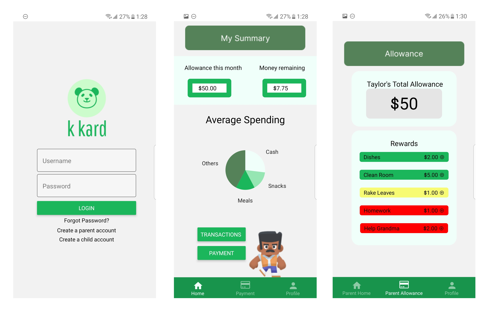
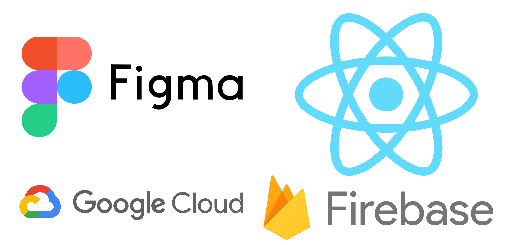

# k kard :credit_card:
## HackWestern 7: FuturFund - Women in Financial Literacy Award :trophy: <br/> HackWestern 7: Deloite - Perfect Pitch Award :trophy:
## Inspiration
As we are all heading into a future that is going towards paper free, contactless payments, millennial parents are finding it inconvenient to provide their kids with paper cash allowances. Millennial parents no longer carry cash these days. 34% of adults under the age of 50 make zero cash purchases in a typical week according to The Pew Research Center. Unfortunately, cash is no longer king.  

  
*Pew Research Center,* Andrew Perrin (2018). *[More Americans are making no weekly purchases with cash](https://www.pewresearch.org/fact-tank/2018/12/12/more-americans-are-making-no-weekly-purchases-with-cash/)*

Molly is a young mom with 2 kids who are growing up and wanting to be more independent. She wants to teach them the importance of budgeting and finances by allowing them to participate in the process of making their own purchase decisions. She only uses credit card payment on her phone and rarely carries cash so it’s inconvenient to give her kids cash for allowance. She also doesn’t want to give them a credit or debit card yet as she’s unsure if they’re responsible with making financial decisions yet.

How do we find a paper free way to provide our children with allowance such that they can learn more about their spending habits and budgeting without having to worry they might face fraud or make an unreasonable purchase with a credit or debit card?

## What it does
Introducing ***k kard,*** a Konvenient and Kool way to pay.  

  

***k kard*** is a mobile application, compatible with iOS and Android that provides a fun yet educational, safe and contactless payment solution such that parents can manage each transaction made by their child through a mobile platform. It is aimed towards millennial parents with children ages 8-12 who want to provide allowance without the hassle of dealing with cash or worrying about unreasonable transactions. ***k kard*** not only allows the child to make purchases through their own account, but tracks their spending and detects purchases out of the norm to alert parents when there is suspicious activity.  

  

## Try it out!
### Pre-requisites
```
npm install -g expo-cli
npm install
```

### Run locally on Expo
```
expo start
```

Click image below for demo video (or click [here](https://youtu.be/3eHyQgif-yI))
[](https://youtu.be/3eHyQgif-yI)

## How we built it
The frontend of the application was prototyped using **Figma** and developed using **React Native,** while **Google Firebase** was incorporated for backend. The **Google Cloud Vision API** was utilized to implement object recognition.



## Challenges we ran into
Everyone on the team is new to mobile app development so there was a struggle setting up the dev environment and learning a new tech stack. Integrating the camera authorization functionality of the app was the most challenging obstacle we faced. Additionally, building the bridge between Google Cloud Vision and React Native was difficult as none of us has any experience with either of the technologies prior to this project.

Although these drawbacks did set our timeline back by a few hours, our team collaborated to resolve these issues.

## Accomplishments that we're proud of and what we learned
We are excited to be able to demo a fully-functioning app, developed by 4 people that share the same drive, with little to no app development experience in only 36 hours. Between the naps and coffee breaks, in the past 36 hours we gained a vast set of skills, including using React Native, Figma, Firebase, Google Cloud Vision, presentation and pitching skills. Our team consists of a business major, a business and computer science major, and two engineering majors, allowing us to think about our ideas from a more diverse perspective. We're proud to learn key skills from one another!

## What's next for ***k kard***
At ***k kard,*** we not only value the convenience for parents, but we hope to increase financial literacy among the next generation of leaders. We would like to include more features to analyze and visualize spending habits of the children with machine learning to outline to kids what purchase patterns they can have to save more money and to provide their parents an insight into their child’s understanding of finances.

As fintech continues to expand, more precautions need to be made to ensure security so we are thinking of implementing biometrics authentication in the future. Currently the app only supports one child per parent but we wish to improve and allow the parent account to be linked to all their children. We are also excited about creating a savings account feature so the child can set aside an amount in their own “savings” to accumulate a desired interest the parent sets. Here the parent can help the child understand what interest is, the value of a dollar along with inflation rates, and importance of setting money aside in savings.

There is also the function for the child to learn about charitable donations. Here the parent can further bond with the child to learn about their interests and passions to show which charitable organization resonates the greatest with the child. Once the organization is determined by the child, they have the option to allocate part of their allowance to the charity. This amount will be donated directly to the organization.